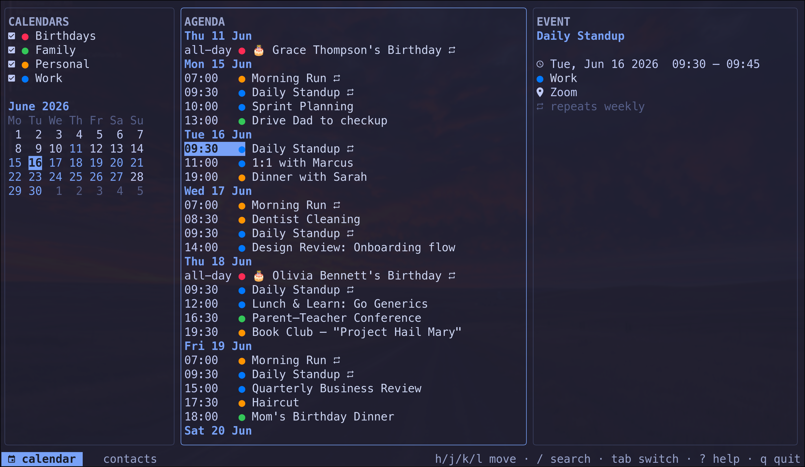
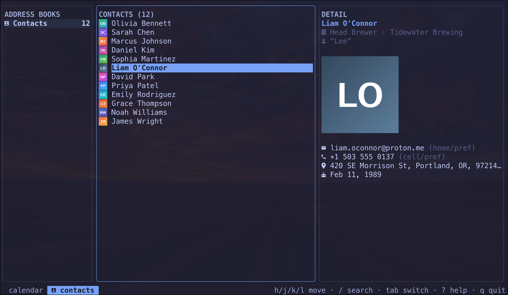

# Yoro

> A blazing-fast, terminal UI for your contacts and calendar.




Yoro is a TUI for browsing and editing calendars and contacts from two kinds of
**source**, treated as co-equal first-class citizens:


- **Local vdir trees** in the standard [vdirsyncer](https://vdirsyncer.pimutils.org/)/[khal](https://lostpackets.de/khal/)
  layout — plain iCalendar (`.ics`) and vCard (`.vcf`) files on disk.
- **Remote CalDAV/CardDAV servers** (iCloud, Fastmail, Nextcloud, Google, …), read live.

You can browse several sources at once; every collection shows where it came from. Yoro is
a *pure client* to each source. It never syncs sources to each other. Keeping a local vdir
in step with a DAV server is [vdirsyncer's](docs/vdirsyncer.md) job, by design.

Yoro is deeply inspired by [`yazi`](https://github.com/sxyazi/yazi):
miller-column navigation, a live preview pane that follows your cursor, nerd-font icons,
and vim keybindings throughout.

## Features

- **Local + DAV.** First-class support for the `vdirsyncer`/`khal` on-disk format *and* live CalDAV/CardDAV servers, browsed together with clear per-collection provenance.
- **Two modes, one feel.** A Calendar mode and a Contacts mode that share the same vim
  navigation and preview-follows-cursor behavior.
- **Calendar.** A day-grouped agenda with a mini-month navigator and per-collection color
  toggles. Recurring events (`RRULE`/`RDATE`/`EXDATE`) are expanded on the fly, and a
  structured **Repeat** picker in the create/edit form sets the recurrence (whole series).
- **Contacts.** A three-column miller view (address books → contacts → detail) with live
  search.
- **Modern graphics.** Uses the kitty graphics protocol to render contact photos where the
  terminal (and embedded vCard `PHOTO` data) support it, degrading gracefully otherwise.
- **Single static binary.** Written in modern Go, `CGO_ENABLED=0`, no runtime dependencies.

## Installation

### Arch Linux (AUR)

```sh
# release binary
yay -S yoro-bin
# or build from latest git
yay -S yoro-git
```

### From source

Requires Go 1.26+.

```sh
git clone https://github.com/zackb/yoro
cd yoro
make build
make install   # installs to /usr/local by default; override with PREFIX=
```

## Usage

```sh
yoro                              # browse the configured sources
yoro --calendars DIR --contacts DIR   # override the default local source's paths
```

With no config file, Yoro reads a single local source from:

| Data      | Path                              |
| --------- | --------------------------------- |
| Calendars | `~/.local/share/calendars`        |
| Contacts  | `~/.local/share/contacts`         |

### Configuration

To browse more than one source create `$XDG_CONFIG_HOME/yoro/config.toml` (usually
`~/.config/yoro/config.toml`). Each `[[sources]]` block is one source, browsed in order.

> **Connecting an account?** [docs/accounts.md](docs/accounts.md) has copy-paste
> `[[sources]]` recipes for **local vdir, Nextcloud, Google, iCloud, and Fastmail**,
> including where each provider's app password comes from.

```toml
# A local vdir tree (default if you list no sources).
[[sources]]
name = "local"
type = "local"
calendars = "~/.local/share/calendars"
contacts  = "~/.local/share/contacts"

# A remote CalDAV/CardDAV account.
[[sources]]
name = "iCloud"
type = "dav"
url  = "https://caldav.icloud.com/"
username = "you@icloud.com"
# Resolve the secret from a command so no plaintext lives in the config.
password_command = "pass icloud/yoro"
# password = "..."   # alternatively, an inline secret (discouraged)
```

Notes:

- **Source names must be unique** — the name is the source's identity.
- **`password_command`** is run via the shell: (`pass`, `secret-tool`, `op read`, …). Prefer it over `password`.
- **Calendars** from every source are overlaid in the agenda, tagged by source.
  **Contacts** show one source at a time. Press `s` to switch.
- **Split hosts (iCloud):** some providers serve calendars and contacts at
  different hostnames. Yoro probes both protocols at the `url` you give; if a
  provider splits them, add two `dav` sources, one per host.
- Yoro does **not** sync sources — see [docs/vdirsyncer.md](docs/vdirsyncer.md).

### Keybindings

Yoro uses vim motions, deviating only where a calendar has no filesystem analog.

| Key            | Action                                          |
| -------------- | ----------------------------------------------- |
| `Tab` `1` `2`  | Switch between Calendar and Contacts            |
| `h`            | Move focus to the column on the left            |
| `l` / `Enter`  | Move focus into the column on the right         |
| `j` / `k`      | Move down / up                                  |
| `gg` / `G`     | Jump to top / bottom                            |
| `ctrl+d` / `ctrl+u` | Half-page down / up                        |
| `ctrl+f` / `ctrl+b` | Page down / up                             |
| `a`            | Create a new event / contact in the selected collection |
| `e`            | Edit the selected event / contact                          |
| `d`            | Delete the selected event / contact |
| `R`            | Reload the store from disk                       |
| `?`            | Toggle help                                     |
| `q` / `ctrl+c` | Quit                                            |

**Calendar mode**

| Key       | Action                                       |
| --------- | -------------------------------------------- |
| `t`       | Jump to today                                |
| `}` / `{` | Next / previous day with events              |
| `J` / `K` | Next / previous month in the mini-month      |
| `space`   | Toggle the highlighted collection on/off     |
| `T`       | Toggle visibility of tasks (VTODO)           |

**Contacts mode**

| Key | Action                                              |
| --- | --------------------------------------------------- |
| `/` | Search contacts (`esc` clears)                      |
| `y` | Yank the highlighted email/phone to the clipboard   |
| `s` | Switch the active contacts source (local / DAV)     |

## Development

```sh
make build    # static binary into ./build
make test     # go test ./...
make lint     # gofmt + go vet
make run      # build and run
```

See [`man/yoro.1`](man/yoro.1) for the manual page.

## Roadmap

- [x] Read-only local browsing (Calendar + Contacts) — **Milestone 1**
- [x] Read-only CalDAV/CardDAV browsing + multi-source provenance
- [x] Create new events and contacts (local file write + DAV `PUT`)
- [x] Edit existing events and contacts in place (preserves unmodeled fields)
- [x] Delete events and contacts (local file + DAV)
- [x] Create/edit/delete recurring events (whole series, structured repeat picker)
- [x] Full month-grid calendar view (toggle)
- [ ] Per-instance recurring edits (`RECURRENCE-ID` / this-and-future)
- [ ] `If-Match` conditional `PUT`s once go-webdav exposes them

## License

MIT — see [LICENSE](LICENSE).
